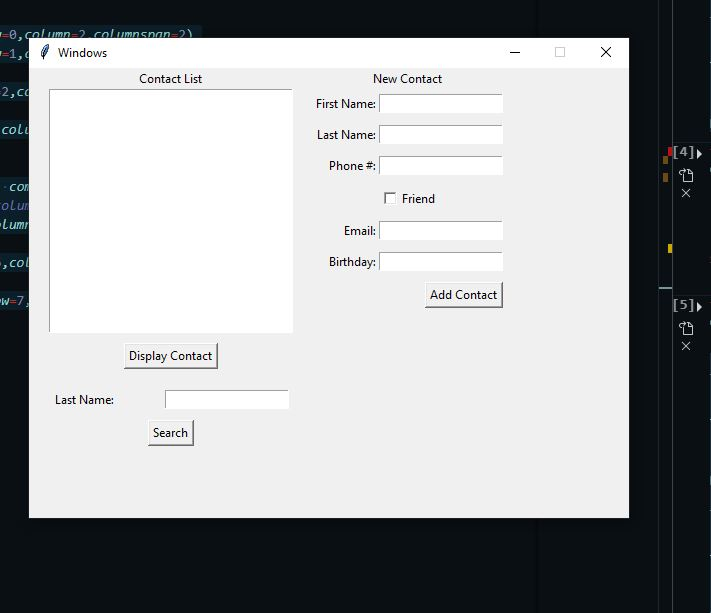

# Tkinter-toolbox-Python-GUI
This repo is a toolbox. It aims to give some generic coding examples to help organize Tkinter's geometry and widgets.

There is a link to the source for the most specific codes, but I couldn't find the source back for the most generic ones.

